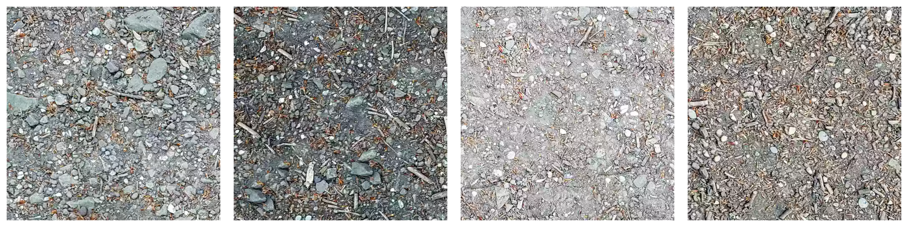
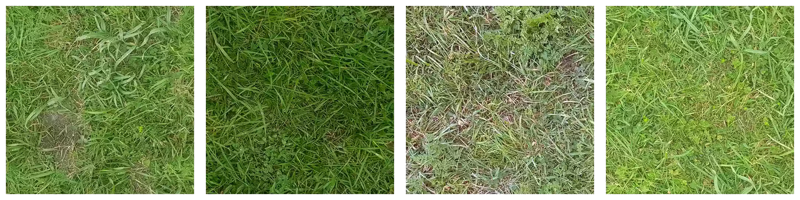
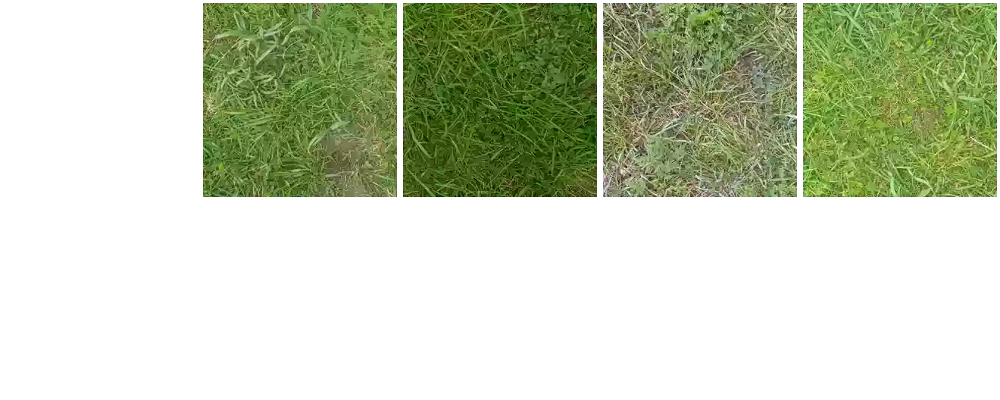
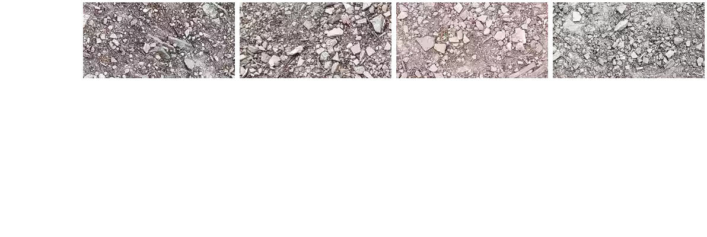
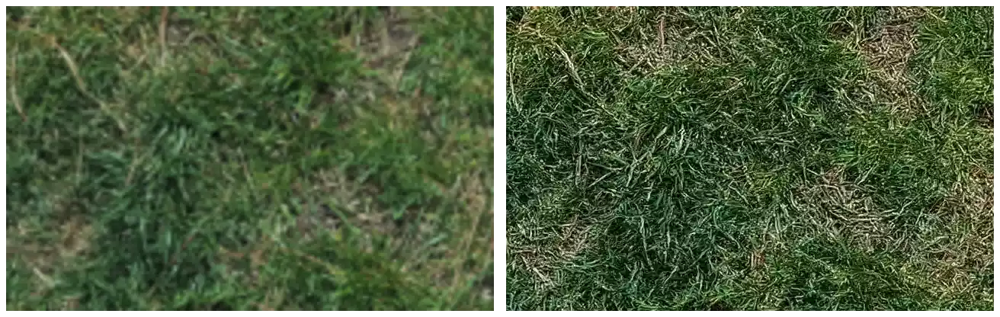

texturize
=========

A command-line tool and Python library to automatically generate new textures similar
to a source image or photograph.  It's useful in the context of computer graphics if
you want to make variations on a theme or expand the size of an existing texture.

This software is powered by deep learning technology — using a combination of
convolution networks and example-based optimization to synthesize images.  We're
building ``texturize`` as the highest-quality open source library available!

1. `Examples & Demos <#1-examples--demos>`_
2. `Commands <#2-commands>`_
3. `Options & Usage <#3-options--usage>`_
4. `Installation <#4-installation>`_

|Python Version| |License Type| |Project Stars| |Build Status|

----

1. Examples & Demos
===================

The examples are available as notebooks, and you can run them directly in-browser
thanks to Jupyter and Google Colab:

* **Gravel** — `online demo <https://colab.research.google.com/github/photogeniq/neural-texturize/blob/master/examples/Demo_Gravel.ipynb>`__ and `source notebook <https://github.com/photogeniq/neural-texturize/blob/master/examples/Demo_Gravel.ipynb>`__.
* **Grass** — `online demo <https://colab.research.google.com/github/photogeniq/neural-texturize/blob/master/examples/Demo_Grass.ipynb>`__ and `source notebook <https://github.com/photogeniq/neural-texturize/blob/master/examples/Demo_Grass.ipynb>`__.

These demo materials are released under the Creative Commons `BY-NC-SA license <https://creativecommons.org/licenses/by-nc-sa/3.0/>`_, including the text, images and code.

2. Commands
===========

a) REMIX
--------

    Generate a variation of any shape from a single texture.

Remix Command-Line
~~~~~~~~~~~~~~~~~~

.. code-block:: bash

    Usage:
        texturize remix SOURCE...

    Examples:
        texturize remix samples/grass.webp --size=720x360
        texturize remix samples/gravel.png --size=512x512

Remix Library API
~~~~~~~~~~~~~~~~~

.. code-block:: python

    from texturize import api, commands, io

    # The input could be any PIL Image in RGB mode.
    image = io.load_image_from_file("input.png")

    # Coarse-to-fine synthesis runs one octave at a time.
    remix = commands.Remix(image)
    for result in api.process_octaves(remix, octaves=5):
        pass

    # The output can be saved in any PIL-supported format.
    result.image.save("output.png")

Remix Examples
~~~~~~~~~~~~~~

.. Remix Online Tool
.. ~~~~~~~~~~~~~~~~~
.. * `colab notebook <https://colab.research.google.com/github/photogeniq/neural-texturize/blob/master/examples/Tool_Remix.ipynb>`__

----

b) REMAKE
---------

    Reproduce an original texture in the style of another.

Remake Command-Line
~~~~~~~~~~~~~~~~~~~

.. code-block:: bash

    Usage:
        texturize remake TARGET [like] SOURCE

    Examples:
        texturize remake samples/grass1.webp like samples/grass2.webp
        texturize remake samples/gravel1.png like samples/gravel2.png

Remake Library API
~~~~~~~~~~~~~~~~~~

.. code-block:: python

    from texturize import api, commands

    # The input could be any PIL Image in RGB mode.
    target = io.load_image_from_file("input1.png")
    source = io.load_image_from_file("input2.png")

    # Only process one octave to retain photo-realistic output.
    remake = commands.Remake(target, source)
    for result in api.process_octaves(remake, octaves=1):
        pass

    # The output can be saved in any PIL-supported format.
    result.image.save("output.png")

Remake Examples
~~~~~~~~~~~~~~~

.. Remake Online Tool
.. ~~~~~~~~~~~~~~~~~~
.. * `colab notebook <https://colab.research.google.com/github/photogeniq/neural-texturize/blob/master/examples/Tool_Remake.ipynb>`__

----

c) MASHUP
---------

    Combine multiple textures together into one output.

Mashup Command-Line
~~~~~~~~~~~~~~~~~~~

.. code-block:: bash

    Usage:
        texturize mashup SOURCE...

    Examples:
        texturize mashup samples/grass1.webp samples/grass2.webp
        texturize mashup samples/gravel1.png samples/gravel2.png

Mashup Library API
~~~~~~~~~~~~~~~~~~

.. code-block:: python

    from texturize import api, commands

    # The input could be any PIL Image in RGB mode.
    sources = [
        io.load_image_from_file("input1.png"),
        io.load_image_from_file("input2.png"),
    ]

    # Only process one octave to retain photo-realistic output.
    mashup = commands.Mashup(sources)
    for result in api.process_octaves(mashup, octaves=5):
        pass

    # The output can be saved in any PIL-supported format.
    result.image.save("output.png")

Mashup Examples
~~~~~~~~~~~~~~~

.. Mashup Online Tool
.. ~~~~~~~~~~~~~~~~~~
.. * `colab notebook <https://colab.research.google.com/github/photogeniq/neural-texturize/blob/master/examples/Tool_Mashup.ipynb>`__

----

d) ENHANCE
----------

    Increase the resolution or quality of a texture using another as an example.

Enhance Command-Line
~~~~~~~~~~~~~~~~~~~~

.. code-block:: bash

    Usage:
        texturize enhance TARGET [with] SOURCE

    Examples:
        texturize enhance samples/grass1.webp with samples/grass2.webp
        texturize enhance samples/gravel1.png with samples/gravel2.png

Enhance Library API
~~~~~~~~~~~~~~~~~~~

.. code-block:: python

    from texturize import api, commands

    # The input could be any PIL Image in RGB mode.
    target = io.load_image_from_file("input1.png")
    source = io.load_image_from_file("input2.png")

    # Only process one octave to retain photo-realistic output.
    enhance = commands.Enhance(target, source, zoom=2)
    for result in api.process_octaves(enhance, octaves=2):
        pass

    # The output can be saved in any PIL-supported format.
    result.image.save("output.png")

Enhance Examples
~~~~~~~~~~~~~~~~

.. Enhance Online Tool
.. ~~~~~~~~~~~~~~~~~~~
.. * `colab notebook <https://colab.research.google.com/github/photogeniq/neural-texturize/blob/master/examples/Tool_Enhance.ipynb>`__

----

3. Options & Usage
==================

For details about the command-line usage of the tool, see the tool itself:

.. code-block:: bash

    texturize --help

Here are the command-line options currently available, which apply to most of the
commands above::

    Options:
        SOURCE                  Path to source image to use as texture.
        -s WxH, --size=WxH      Output resolution as WIDTHxHEIGHT. [default: 640x480]
        -o FILE, --output=FILE  Filename for saving the result, includes format variables.
                                [default: {command}_{source}{variation}.png]

        --weights=WEIGHTS       Comma-separated list of blend weights. [default: 1.0]
        --zoom=ZOOM             Integer zoom factor for enhancing. [default: 2]

        --variations=V          Number of images to generate at same time. [default: 1]
        --seed=SEED             Configure the random number generation.
        --mode=MODE             Either "patch" or "gram" to manually specify critics.
        --octaves=O             Number of octaves to process. [default: 5]
        --threshold=T           Quality for optimization, lower is better.  Defaults to 1e-3
                                for "patch" and 1e-7 for "gram".
        --iterations=I          Maximum number of iterations each octave. [default: 99]
        --device=DEVICE         Hardware to use, either "cpu" or "cuda".
        --precision=PRECISION   Floating-point format to use, "float16" or "float32".
        --quiet                 Suppress any messages going to stdout.
        --verbose               Display more information on stdout.
        -h, --help              Show this message.

4. Installation
===============

Existing Python [fastest]
-------------------------

We recommend using a `Miniconda <https://docs.conda.io/en/latest/miniconda.html>`__ to
manage your Python environments.  If you have Python 3.6+ already running, you first
need to ensure that PyTorch is available as per the `official installation guide <https://pytorch.org/get-started/locally/>`__:

.. code-block:: bash

    # a) Use this if you have an *Nvidia GPU only*.
    #   - with `conda`
    conda install pytorch torchvision cudatoolkit=10.2 -c pytorch
    #   - with `pip`
    pip install torch==1.5.1+cu102 torchvision==0.6.1+cu102 -f https://download.pytorch.org/whl/torch_stable.html

    # b) Fallback if you just want to run on CPU.
    #   - with `conda`
    conda install pytorch torchvision cpuonly -c pytorch
    #   - with `pip`
    pip install torch==1.5.1+cpu torchvision==0.6.1+cpu -f https://download.pytorch.org/whl/torch_stable.html

.. note::
    Any version of CUDA is suitable as long as PyTorch is working.  Replace the string
    ``10.2`` or ``102`` in the script above with the version of CUDA driver you have
    installed on your machine.

Then, you can fetch the latest version of the library from the Python Package Index
(PyPI) using the following command:

.. code-block:: bash

    pip install texturize

Finally, you can check if everything worked by calling the command-line script:

.. code-block:: bash

    texturize --help

Use ``pip uninstall`` to remove these packages once you are done.

Conda Environment [reliable]
----------------------------

If you're a developer and want to install the library locally, start by cloning the
repository to your local disk:

.. code-block:: bash

    git clone https://github.com/photogeniq/neural-texturize.git

Then, you can create a new virtual environment called ``myenv`` by installing
`Miniconda <https://docs.conda.io/en/latest/miniconda.html>`__ and calling the following
commands, depending whether you want to run on CPU or GPU (via CUDA):

.. code-block:: bash

    cd neural-texturize

    # a) Use this if you have an *Nvidia GPU only*.
    conda env create -n myenv -f tasks/setup-cuda.yml

    # b) Fallback if you just want to run on CPU.
    conda env create -n myenv -f tasks/setup-cpu.yml

Once the virtual environment is created, you can activate it and finish the setup of
``neural-texturize`` with these commands:

.. code-block:: bash

    conda activate myenv
    poetry install

Finally, you can check if everything worked by calling the script:

.. code-block:: bash

    texturize --help

You can use ``conda env remove -n myenv`` to delete the virtual environment once you
are done.

----

|Python Version| |License Type| |Project Stars| |Build Status|

.. |Python Version| image:: https://img.shields.io/pypi/pyversions/texturize
    :target: https://www.python.org/

.. |License Type| image:: https://img.shields.io/badge/license-AGPL-blue.svg
    :target: https://github.com/photogeniq/neural-texturize/blob/master/LICENSE

.. |Project Stars| image:: https://img.shields.io/github/stars/photogeniq/neural-texturize.svg?style=flat
    :target: https://github.com/photogeniq/neural-texturize/stargazers

.. |Project Status| image:: https://img.shields.io/pypi/status/texturize
    :alt: PyPI - Status

.. |Build Status| image:: https://img.shields.io/github/workflow/status/photogeniq/neural-texturize/build
    :alt: GitHub Workflow Status
