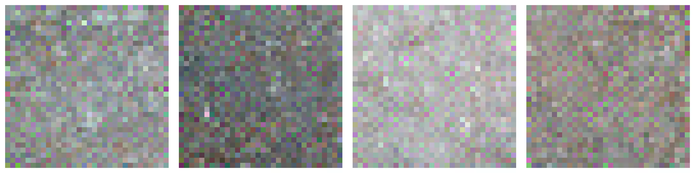

neural-texturize
================

Automatically generate new textures similar to your source image.  Useful if you
want to make variations on a theme or expand the size of an existing texture.

1. Examples & Usage
===================

The main script takes a source image as a texture, and generates a new output that
captures the style of the original.  Here are some examples:

.. code-block:: bash

    texturize samples/grass.webp --size=1440x960 --output=result.png
    texturize samples/gravel.png --iterations=200 --precision=1e-5
    texturize samples/sand.tiff  --output=tmp/{source}-{octave}.webp
    texturize samples/brick.jpg  --device=cpu

For details about the command-line options, see the tool itself:

.. code-block:: bash

    texturize --help

Here are the command-line options currently available::

    Usage:
        texturize SOURCE... [--size=WxH] [--output=FILE] [--variations=V] [--seed=SEED]
                            [--mode=MODE] [--octaves=O] [--threshold=H] [--iterations=I]
                            [--device=DEVICE] [--precision=PRECISION] [--quiet] [--verbose]

    Options:
        SOURCE                  Path to source image to use as texture.
        -s WxH, --size=WxH      Output resolution as WIDTHxHEIGHT. [default: 640x480]
        -o FILE, --output=FILE  Filename for saving the result, includes format variables.
                                [default: {source}_gen{variation}.png]
        --variations=V          Number of images to generate at same time. [default: 1]
        --seed=SEED             Configure the random number generation.
        --mode=MODE             Either "patch" or "gram" to specify critics. [default: gram]
        --octaves=O             Number of octaves to process. [default: 5]
        --threshold=T           Quality for optimization, lower is better. [default: 1e-4]
        --iterations=I          Maximum number of iterations each octave. [default: 99]
        --device=DEVICE         Hardware to use, either "cpu" or "cuda".
        --precision=PRECISION   Floating-point format to use, "float16" or "float32".
        --quiet                 Suppress any messages going to stdout.
        --verbose               Display more information on stdout.
        -h, --help              Show this message.

2. Installation
===============

This repository uses submodules, so you'll need to clone it recursively to ensure
dependencies are available:

.. code-block:: bash

    git clone --recursive https://github.com/photogeniq/neural-texturize.git

Then, you can create a new virtual environment called ``myenv`` by installing
`Miniconda <https://docs.conda.io/en/latest/miniconda.html>`_ and calling the following
commands, depending whether you want to run on CPU or GPU (via CUDA):

.. code-block:: bash

    cd neural-texturize

    # a) Use this if you have an *Nvidia GPU only*.
    conda env create -n myenv -f tasks/setup-cuda.yml

    # b) Fallback if you just want to run on CPU.
    conda env create -n myenv -f tasks/setup-cpu.yml

Once the virtual environment is created, you can activate it and finish the setup of
``neural-texturize`` with these commands:

.. code-block:: bash

    conda activate myenv
    poetry install

Finally, you can check if everything worked by calling the script:

.. code-block:: bash

    texturize

You can use ``conda env remove -n myenv`` to delete the virtual environment once you
are done.
